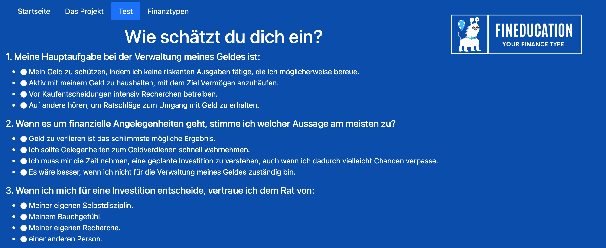
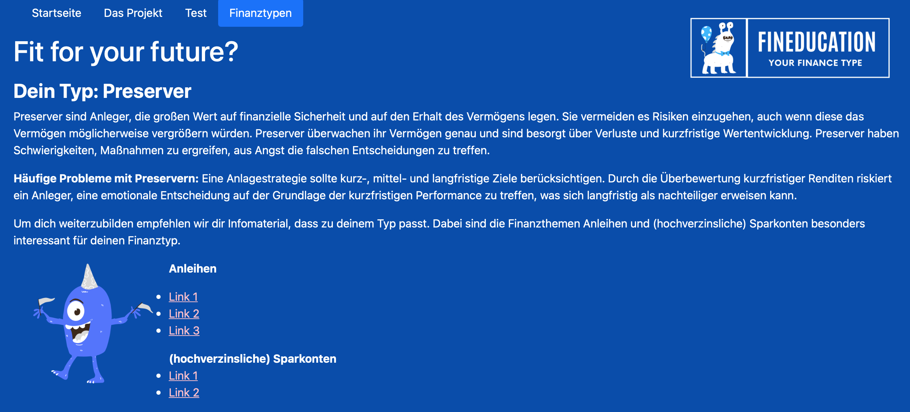

# fineducation

# Become a financial expert!
## Brief summary of the project

We see a fundamental problem in the lack of financial education at school and think that pupils should start learning how the financial system works at least in secondary school. In our opinion, financial knowledge should be established at the latest when the first salary or the first larger budget becomes available. Many young people see finance as a very complex subject. We believe that a financial education program for the younger generation must address different preferences and take into account that an overriding interest in financial topics does not necessarily exist. Therefore, our goal was to create a working solution that presents individually meaningful learning content depending on these preferences. 

## Introduction
### What is the idea / background of the project?

We see a fundamental problem in the lack of financial education at school and think that pupils should start learning how the financial system works at least in secondary school. In our opinion, financial knowledge should be established at the latest when the first salary or the first larger budget becomes available. Many young people see finance as a very complex subject. We believe that a financial education program for the younger generation must address different preferences and take into account that an overriding interest in financial topics does not necessarily exist. Therefore, our goal was to create a working solution that presents individually meaningful learning content depending on these preferences. 

## Methodology
### Which methods / tools from your learning tracks did you use to solve the problem? 

In order to specify how our actual solution could look like, we first collected the ideas of the individual team members by each creating and presenting a user story that represented how a potential user would interact with the respective solution. We then combined the best ideas and derived both a best-case solution and a slightly less sophisticated but equally functional solution. 

For the technical implementation, knowledge of HTML and CSS from the web development track was essential for the development of the frontend. The Backend was mainly programmed in Python. To make the quiz user-friendly, the web framework Flask and WTForms were also used. 

## Result

The result of the project is a functional website on which users can find out about the four different financial types and take a 10-question test which, by evaluating the answers given, enables the user to find out their individual financial txpe. Depending on the financial type, the user recives recommended materials that are structured in such a way that general financial knowledge can be built up step by step, followed by expertise regarding the financial products that match the financial type determined. Thus, the project can contribute to reducing the lack of financial education among students and young adults so that they are better prepared for the challenges that await them in this area. 

Here we have some insights of our website fineduction:

A snippet from the quiz (total: 10 questions) to find out the individual financial type

 

A snippet from the type analysis with matching link recommendations depending on the type

 

Fineducation has additional abilities. So, make sure, you find out on your own financial type!

## Our Team

Alina: Web Development Track
Niklas: UX Design Track
Malte: Data Science Track
Max: Data Science Track
Theresa: Data Science Track

